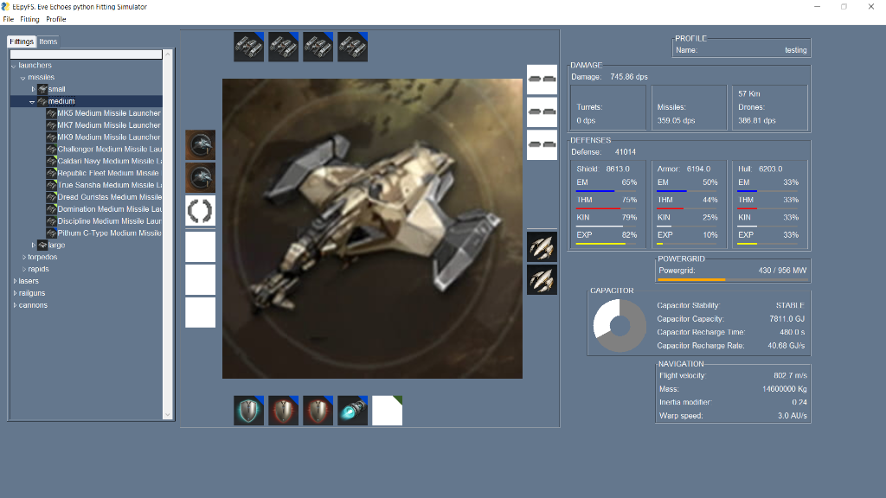

# EEpyFS: Eve Echoes python Fitting Simulator

## Running

Clone the repository with

`git clone https://github.com/agjunyent/EEpyFS.git`

or download as .zip and extract.

CD into the folder and run `python EEpyFS.py`

## Install required programs/packages

### Install Python

Download and install Python from here: [python.org/downloads](https://www.python.org/downloads/)

### Install required Python packages

Open Command Prompt
Run the following commands

`curl https://bootstrap.pypa.io/get-pip.py -o get-pip.py`

`python get-pip.py`

`python -m pip install PySimpleGUI`

`python -m pip install PyYAML`

`python -m pip install opencv_python`

`pip install numpy==1.19.3`
